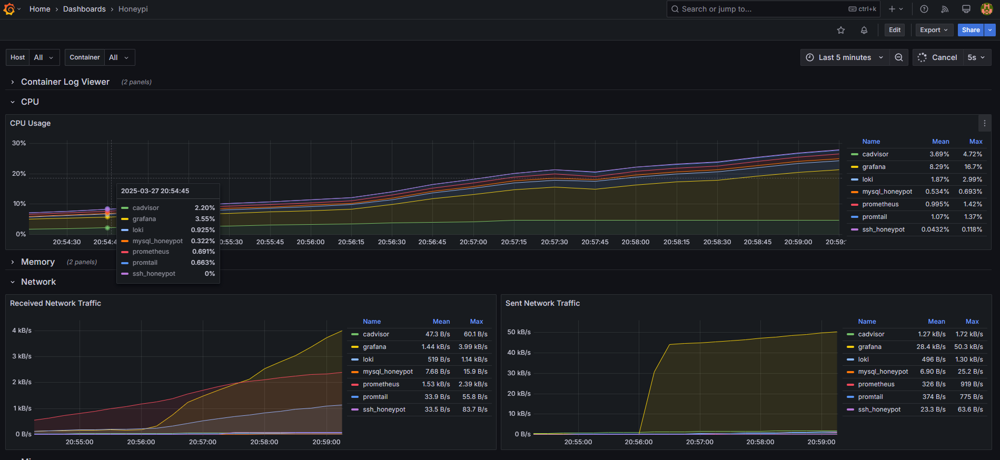

---

HoneyPi is a portable honeypot used for intrusion detection and exploitation analysis.  This device allows connectivity to deployed decoy environments that
are designed to attract cyber threat actors.  Using docker containers, the HoneyPi simulates realistic targets and fictitious sensitive data.  By intentionally
exposing the decoy environments to a local network, HoneyPi allows system administrators to observe and log common attack methods in a controlled environment.

The purpose of HoneyPi is to educate users on the common techniques threat actors might use to compromise a system.  Using the device for its intended
purpose enables cybersecurity professionals to:

  - Understand how attackers operate.
  - Learn about common tactics, techniques, and procedures used by adversaries.
  - Develop cyber defense strategies based on real time logging and metrics.

By showcasing the importance of proactive security measures, HoneyPi contributes to raising awareness and equipping
its users with practical knowledge of how to detect and mitigate cyber threats.

# Usage

HoneyPi is a powerful honeypot monitoring solution that is designed to capture, visualize, and analyze attacker behavior in real-time using container-based decoy services.
Once deployed, the HoneyPi acts as a lightweight, Network Intrustion Detection System (NIDS) by collecting detailed logs and performance metrics across containers and
presenting them in a visual format using a grafana dashboard.

## Analyzing Attack Vectors Through Log Analysis

 HoneyPi deploys decoy services like SSH and MySQL containers that mimic vulnerable systems and real-world scenarios.  These containers log every command, query, and connection
 attempt made by an attacker.  Promtail reads the generated logs and sends them to Loki where they are then sent and made searchable by a grafana dashboard.  Inspecting
 the logs in real-time through alerting mechanisms allows the user to:
  - Detect login attempts
  - Monitor malicious queries or enumeration behavior
  - Track attacker movement
  - Identify common tools or tactics attackers may use

## Container Health Monitoring

In addition to log analysis, HoneyPi integrates additional containers Prometheus and cAdvisor to scrape and monitor performance metrics of each docker container.
These metrics include:
 - CPU and memory usage over time
 - Container uptime
 - Real-time metrics that may indicate spikes in container network activity

## Grafana Dashboard

The grafana dashboard allows HoneyPi to consolodate all logging and metric data into a single interface including features like:
 - Live log panels showing attacker interactions in real-time
 - Metric pannels for CPU, Memory, and Container health
 - Alerting mechanisms that send notifications immediately upon suspicious activity

---

# Build HoneyPi

Want to build your own HoneyPi?
[Click Here](docs/build/Build_HoneyPi.md) to view the Create and Deploy guide!

# Testing & Security

The HoneyPi test plan includes three main sections:
 - __Ad Hoc Tests__: Conducted during initial construction and configuration to identify issues while containers are being deployed.
 - __Unit Tests:__ Utalizes specific test cases covering core components of all the containers including connection, services, logging, and orchestration.
   Specific test cases can be viewed [Here.](tests/HoneyPi_TestCases.xls)
 - __Crowdsourced Tests:__ Peers helped test by simulating real-world attack scenarios.  This included scanning the device, connecting to the containers, and interacting with services.
   All feedback was collected via Google Forms

### Testing Goals:
1. Verify attackers can successfully connect to the containerized services.
2. Ensure all logs and metrics are captured and visualized in Grafana.
3. Integrate modern cyber best practices into system configuration.

See the full [HoneyPi Test Plan](tests/TestPlan-HoneyPi.md) and [HoneyPi SSP](docs/HoneyPi_SSP.pdf) for detailed security and testing requirements!

# __Ethical Notice__

HoneyPi is a cybersecurity education and research tool that is designed to observe threat actor behavior in a controlled environment.  It is __not__ intended for offensive security, exploitation, or use on unauthorized networks.

Users must only deploy a HoneyPi device on networks where they have full permission and where all required participants are informed of its presence and purpose.  It should never be used to
entrap, deceive, or monitor users without their explicit informed consent.

All data that is collected during HoneyPi's operation (logs and metrics) should be handled responsibly and in accordance with privacy laws and ethical standards.  This project is meant to strengthen
cybersecurity posture, and raise awareness.  It is not to be used maliciously or carelessly.  Any misuse of a HoneyPi device outside of the guidelines is strictly discouraged.

